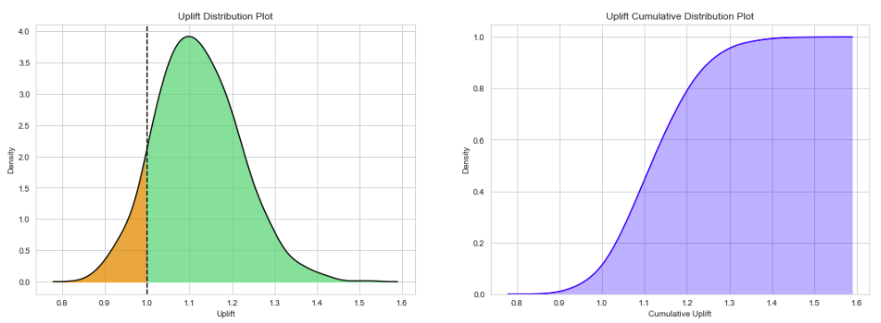
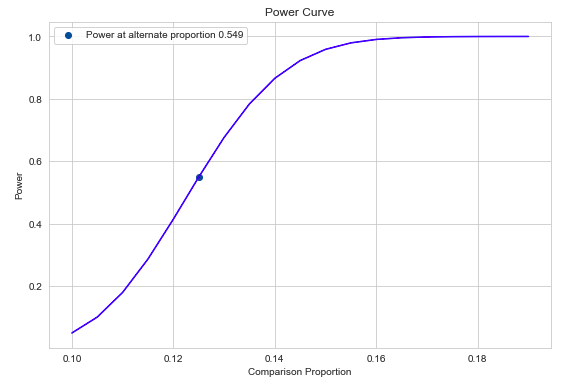

.. image:: https://readthedocs.org/projects/pyab/badge/?version=latest
  :target: https://pyab.readthedocs.io/en/latest/?badge=latest

.. image:: https://img.shields.io/pypi/v/pyAB
  :target: https://github.com/AdiVarma27/pyAB

.. image:: https://img.shields.io/github/labels/AdiVarma27/pyAB/help-wanted
  :target: https://github.com/AdiVarma27/pyAB

.. image:: https://img.shields.io/github/license/AdiVarma27/pyab
  :target: https://github.com/AdiVarma27/pyAB/blob/master/LICENSE

.. image:: https://img.shields.io/github/stars/AdiVarma27/pyAB?logo=Github 
  :target: https://github.com/AdiVarma27/pyAB
 
========
**pyAB**
========
pyAB is a Python package for Bayesian & Frequentist A/B Testing.

========
Features:
========
Bayesian A/B Test:
##################
- Conduct quick experiments to check for winning variant with additional prior information (Beta Distribution parameters).
- Try different evaluation metrics (Uplift Ratio, Uplift Difference & Uplift Percent Gain) & vary number of mcmc simulations.
- Visualize & inspect Uplift Density & Cumulative Density distributions.

Frequentist A/B Test:
#####################
- Conduct quick experiments to check for winning variant using two sample proportion test (Statistical significance).
- Estimate required sample size per variant to reach provided Type-II error rate.
- Visualize & inspect power curve for varying alternative proportions.

============
Installation:
============
Best way to install pyAB is through pip

.. code:: python

   pip install pyAB

To install from source, use the following Github link

.. code:: python

   git clone https://github.com/AdiVarma27/pyAB.git
   cd pyAB
   python setup.py install

============
Dependencies:
============

pyAB has the following dependencies:

- numpy
- matplotlib
- seaborn
- scipy
- statsmodels

=============
Documentation:
=============

pyAB documentation is available at `pyab.readthedocs.io <https://pyab.readthedocs.io/en/latest/>`_ & `pyab.rtfd.io <https://pyab.rtfd.io/en/latest/>`_.

Usage:
######

=================
Bayesian A/B Test
=================

Let us assume we have two Banner Ads and want to run an AB Test to decide on the final version. We run the test and collect 1000 samples per version. We observe 100 and 120 clicks for version-A & Version-B respectively **(10 % & 12.5 % Click-through-rates)**. From our previous experience, we know that the average Click-through-rate for our previous Ads was around 12 %. 

We first need to import  ``ABTestBayesian`` class and provide prior clicks ``success_prior`` and prior impressions ``trials_prior``. Then, call the ``conduct_experiment`` method with successful clicks and impressions per version.

For ``uplift_method``, there are three metrics to choose from are ``'uplift_ratio'``, ``'uplift_percent'`` & ``'uplift_difference'``. We also choose mcmc ``num_simulations``, which samples from Uplift Probability Density function.

.. code:: python

   # import Bayesian class
   from pyab.experiments import ABTestBayesian

   # provide beta priors
   ad_experiment_bayesian = ABTestBayesian(success_prior=120, trials_prior=1000)

   # conduct experiment with two variants successes and trials, along with uplift method and number of simulations
   ad_experiment_bayesian.conduct_experiment(success_null=100, trials_null=1000, 
                                             success_alt=125, trials_alt=1000, 
                                             uplift_method='uplift_ratio', num_simulations=1000)

Bayesian A/B test results can extremely useful to **understand & communicate test results** with other stakeholders and answers the main business question: **Which version works the best ?**

**Output:**

.. code::

   pyAB Summary
   ============

   Test Parameters
   _______________

   Variant A: Successful Trials 100, Sample Size 1000
   Variant B: Successful Trials 125, Sample Size 1000
   Prior: Successful Trials 120, Sample Size 1000

   Test Results
   ____________

   Evaluation Metric: uplift_ratio
   Number of mcmc simulations: 1000

   90.33 % simulations show Uplift Ratio above 1.

====================
Frequentist A/B Test
====================

Let us now run a Frequentist A/B Test and verify if there is a significant difference between two proportions provided the sample sizes and Type-I Error rate. From above, we know the performance of version-A & version-B **(10 % & 12.5 % Click-through-rates)**, for 1000 impressions of each version.

We first need to import  ``ABTestFrequentist`` class and provide type of alternative hypothesis ``alt_hypothesis``, ``'one_tailed'`` or ``'two_tailed'`` & Type-I error rate ``alpha`` (default = 0.05). Then, we call the ``conduct_experiment`` method with successful clicks and impressions per version.

This traditional methodology might be **slightly tricky to communicate**, and **Type-I & Type-II error rates** need to be accounted for, unlike Bayesian methods.

.. code:: python

   # import Frequentist class
   from pyab.experiments import ABTestFrequentist

   # provide significance rate and type of test
   ad_experiment_freq = ABTestFrequentist(alpha=0.05, alt_hypothesis='one_tailed')

   # conduct experiment with two variants successes and trials, returns stat & pvalue
   stat, pvalue = ad_experiment_freq.conduct_experiment(success_null=100, trials_null=1000, 
                                    success_alt=125, trials_alt=1000)

**Output:**

.. code::

   pyAB Summary
   ============

   Test Parameters
   _______________

   Variant A: Success Rate 0.1, Sample Size 1000
   Variant B: Success Rate 0.125, Sample Size 1000
   Type-I Error: 0.05, one_tailed test

   Test Results
   ____________

   Test Stat: 1.769
   p-value: 0.038
   Type-II Error: 0.451
   Power: 0.549

   There is a statistically significant difference in proportions of two variants.

Given that the current Type-II error is 0.451 at 1000 samples per variant, we can find out **required sample size per variant** to reach Type-II error of 0.1.

.. code:: python
   
   # required sample size per variant for given beta
   ad_experiment.get_sample_size(beta=0.1)

**Output:**

.. code::

   2729

=======
License:
=======

`MIT License Copyright (c) 2020 <https://github.com/AdiVarma27/pyAB/blob/master/LICENSE>`_
