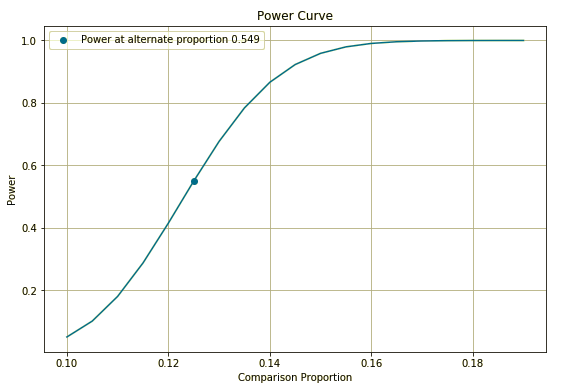

.. image:: https://readthedocs.org/projects/pyab/badge/?version=latest
  :target: https://pyab.readthedocs.io/en/latest/?badge=latest
  :alt: Documentation Status
 
====
pyAB
====
pyAB is a Python package for Frequentist & Bayesian A/B Testing.

Features:
--------
Frequentist A/B Test:
--------------------
- Conduct quick experiments to check for winning variant (Statistical significance).
- Estimate required sample size per variant to reach expected Type-II error rate.
- Visualize & inspect power curve for varying alternative proportions.

Bayesian A/B Test:
-----------------
- Conduct quick experiments to check for winning variant with additional prior information (Beta distribution parameters).
- Try different evaluation metrics (Uplift Ratio, Difference & Percent Gain) & vary MCMC simulation sample size per variant.
- Visualize & inspect Uplift Density & Cumulative Density distributions.

Installation:
------------
Best way to install pyAB is through pip

.. code:: python

   pip install pyAB

To install from source, use the following Github link

.. code:: python

   git clone https://github.com/AdiVarma27/pyAB.git
   cd pyAB
   python setup.py install

Dependencies:
------------

pyAB has the following dependencies:

- numpy
- matplotlib
- seaborn
- scipy
- statsmodels

Documentation:
-------------

pyAB documentation is available at `pyab.readthedocs.io <https://pyab.readthedocs.io/en/latest/>`_ & `pyab.rtfd.io <https://pyab.rtfd.io/en/latest/>`_.

Quick Start:
------------

Code Snippet:

.. code:: python

   # import Frequentist class 
   from pyab.experiments import ABTestFrequentist

   # provide significance rate and type of test
   ad_experiment = ABTestFrequentist(alpha=0.05, alt_hypothesis='one_tailed')

   # conduct experiment with two variants successes and trials, returns stat & pvalue
   stat, pvalue = ad_experiment.conduct_experiment(success_null=100, trials_null=1000, 
                                    success_alt=125, trials_alt=1000)

Output:

.. sourcecode::

   pyAB Summary
   ============

   Test Parameters
   _______________

   Variant A: Success Rate 0.1, Sample Size 1000
   Variant B: Success Rate 0.125, Sample Size 1000
   Type-I Error: 0.05, one_tailed test

   Test Results
   ____________

   There is a statistically significant difference in proportions of two variants

   Test Stat: 1.769
   p-value: 0.038
   Type-II Error: 0.451

Code Snippet:

.. code:: python
   
   # required sample size per variant for given beta
   ad_experiment.get_sample_size(beta=0.1)

Output:

.. sourcecode::

   2729

License:
-------

`MIT License Copyright (c) 2020 <https://github.com/AdiVarma27/pyAB/blob/master/LICENSE>`_
