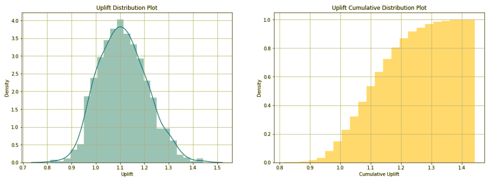
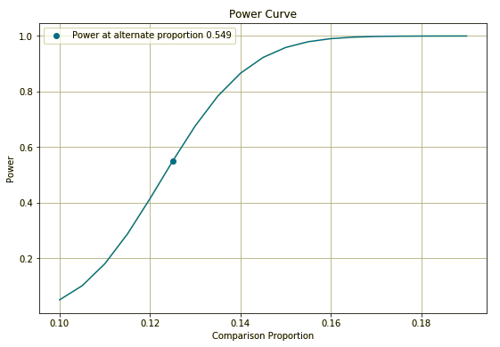

===========
Quick Start
===========

Bayesian A/B Test:
##################
**Let us assume we have two Banner Ads with 10% & 12.5% Click-through-rates. Let us run a Bayesian A/B Test to look at expected Uplift Ratio.**

.. code:: python

   # import Bayesian class
   from pyab.experiments import ABTestBayesian

   # provide beta priors
   ad_experiment_bayesian = ABTestBayesian(success_prior=120, trials_prior=1000)

   # conduct experiment with two variants successes and trials, along with uplift method and number of simulations
   ad_experiment_bayesian.conduct_experiment(success_null=100, trials_null=1000, 
                                             success_alt=125, trials_alt=1000, 
                                             uplift_method='uplift_ratio', num_simulations=1000)

Output:

.. sourcecode::

   pyAB Summary
   ============

   Test Parameters
   _______________

   Variant A: Successful Trials 100, Sample Size 1000
   Variant B: Successful Trials 125, Sample Size 1000
   Prior: Successful Trials 120, Sample Size 1000

   Test Results
   ____________

   Evaluation Metric: uplift_ratio
   Number of mcmc simulations: 1000

   90.33 % simulations show Uplift Ratio above 1.

Frequentist A/B Test:
#####################
**Let us now run a Frequentist A/B Test and verify if there is a significant difference between two proportions provided the sample sizes and Type-I Error rate.**

.. code:: python

   # import Frequentist class
   from pyab.experiments import ABTestFrequentist

   # provide significance rate and type of test
   ad_experiment_freq = ABTestFrequentist(alpha=0.05, alt_hypothesis='one_tailed')

   # conduct experiment with two variants successes and trials, returns stat & pvalue
   stat, pvalue = ad_experiment_freq.conduct_experiment(success_null=100, trials_null=1000, 
                                    success_alt=125, trials_alt=1000)

Output:

.. sourcecode::

   pyAB Summary
   ============

   Test Parameters
   _______________

   Variant A: Success Rate 0.1, Sample Size 1000
   Variant B: Success Rate 0.125, Sample Size 1000
   Type-I Error: 0.05, one_tailed test

   Test Results
   ____________

   Test Stat: 1.769
   p-value: 0.038
   Type-II Error: 0.451
   Power: 0.549

   There is a statistically significant difference in proportions of two variants.

Given that the current Type-II error is 0.451 at 1000 samples per variant, we can find out required sample size per variant to reach Type-II error of 0.1.

.. code:: python
   
   # required sample size per variant for given beta
   ad_experiment.get_sample_size(beta=0.1)

Output:

.. sourcecode::

   2729